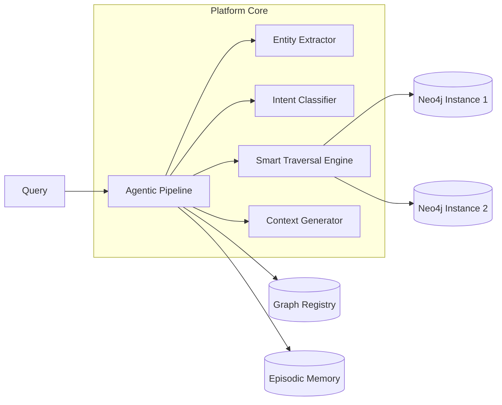

# Graph-RAG: Autonomous Agentic reasoning over Knowledge Graphs
**Research Platform — Version 3.2 (Stable)**

Graph-RAG is a **zero-configuration**, adaptive retrieval-augmented generation platform that enables LLMs to perform multi-hop reasoning over complex, cross-domain knowledge graphs.

Unlike traditional Vector-RAG, which relies on semantic text similarity, Graph-RAG uses structured graph traversals to provide **fully grounded**, verifiable, and non-hallucinatory answers.

---

## 🚀 Research & Innovation Focus

### 1. Autonomous Schema Discovery (Zero-Config)
Connect any Neo4j instance and the platform will automatically bootstrap a reasoning pipeline. It programmatically discovers:
- Node labels and relationship types.
- High-signal identifying properties.
- Intent patterns for natural language query mapping.

### 2. Adaptive Agentic Reasoning Loop
The system utilizes a **Plan → Retrieve → Evaluate → Refine** cycle. If initial graph traversal yields "thin context," the agentic layer automatically re-plans and executes targeted follow-up queries until a high-quality answer is grounded.

### 3. Multi-Tenant Knowledge Registry
The platform supports infinite knowledge graphs. A SQLite-backed registry handles connection credentials, cached schemas, and **isolated memories** for each domain, ensuring query history and episodic data never bleed between graphs.

---

## 🛠 Architectural Overview



### Retrieval Strategies
- **Targeted**: Specific 1-hop fact extraction.
- **Chained**: Multi-hop sequence discovery.
- **Shared Neighbor**: Overlap and relationship pattern detection.
- **Shortest Path**: Finding logical bridges between entities.
- **Neighborhood**: Abstract reasoning over graph motifs.

---

## 🏗 Setup & Deployment

### Prerequisites
- Python 3.10+
- Neo4j (Local or Aura)
- Google Gemini API Key

### Installation
```bash
# Clone the repository
git clone https://github.com/SwapnilK3/Graph-Rag.git
cd Graph-Rag

# Install dependencies
pip install -r requirements.txt

# Configure environment
cp .example.env .env
# Add your NEO4J_URI, GEMINI_API_KEY, etc.
```

### Usage (Platform Mode)
The V3.2 platform is designed to run as a microservice:
```bash
# Start the Backend (API & Registry)
uvicorn graph_rag.api:app --port 8080

# Start the Frontend Dashboard
cd frontend
python -m http.server 3000
```

---

## 📊 Evaluation & Testing
The project includes an extensive test suite for research validation:
- **`test_hopping.py`**: Validates multi-hop retrieval accuracy.
- **`test_complex_pipeline.py`**: End-to-end agentic loop evaluation.
- **`graph_rag/evaluator.py`**: Built-in context quality scoring.

---

## 📄 Research Documentation
For a deep dive into the methodology and algorithms, see:
- [RESEARCH_TECHNICAL_REPORT.md](RESEARCH_TECHNICAL_REPORT.md) — The comprehensive methodology brief.
- [Architecture.md](graph_rag/Architecture.md) — Detailed system diagrams and logic flows.
- [Walkthrough](WALKTHROUGH.md) — Step-by-step logic trace.

---

## ⚖ License & Disclaimer
This is a research prototype. Answers are strictly grounded in the provided graph context. If the graph contains errors, the answer will reflect them. The system is designed for high-precision, low-hallucination domain-specific tasks.
