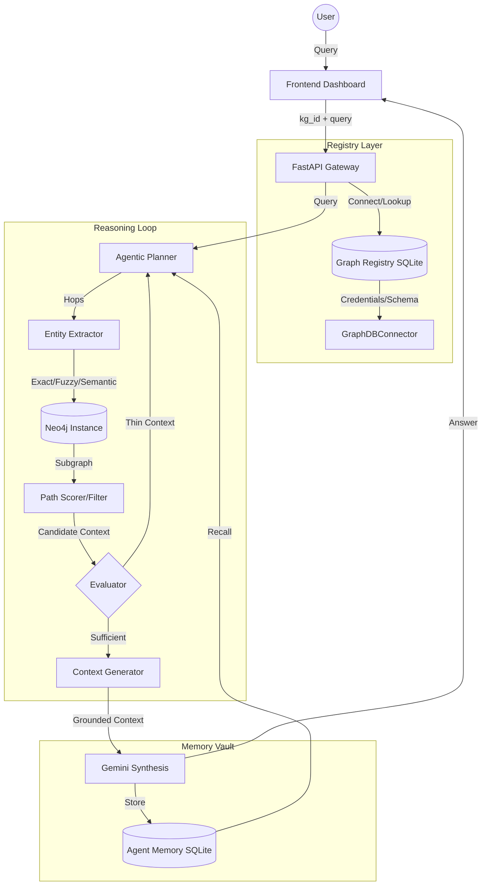

# Graph-RAG: Adaptive Agentic Reasoning over Knowledge Graphs
**Research Technical Report — Version 3.2 (Platform Release)**

## 1. Abstract
Knowledge Graph Retrieval-Augmented Generation (Graph-RAG) addresses the limitations of semantic vector-based RAG—specifically the failure to model multi-hop relationships and the risk of hallucination when context is missing. This platform implements a **"Plug-and-Play" autonomous Graph-RAG system** that performs zero-config schema discovery, iterative agentic planning, and grounded reasoning across heterogeneous knowledge graphs.

## 2. Core Methodology
The system employs an **Agentic Reasoning Loop** (Fig 1.) that treats retrieval not as a single fetch, but as an iterative process of discovery.

### 2.1 The Agentic Loop (Plan → Retrieve → Evaluate → Refine)
1.  **Plan**: The LLM analyzes the query and identifies entity entry points.
2.  **Retrieve**: The system executes targeted graph traversals using five pre-defined strategies (Targeted, Chained, Variable-hop, Shortest-path, Shared-neighbor).
3.  **Evaluate**: An **Evaluator** component checks the retrieved context for "High-Signal" content (e.g., path quality, relationship density).
4.  **Refine**: If the context is insufficient (Thin Context), the **Planner** re-formulates a new sub-query or focuses on a specific missing relationship to fill the gap.

### 2.2 Domain Guard
To achieve **Zero Hallucination**, the system implements a "Domain Guard" at the entity extraction phase. If no matching nodes are found in the graph, the system rejects the query *before* an LLM call is made, preventing the model from hallucinating a "plausible but ungrounded" answer.

## 3. Key Innovations

### 3.1 Autonomous Schema Discovery (Zero-Config)
The system eliminates the need for manual mapping. Upon connecting to a new graph, it performs:
- **Label Profiling**: Identifying all available node types.
- **Searchable Property Detection**: Uses frequency-based heuristics to determine which properties (name, title, brand) contain the core entity identifiers.
- **Config Auto-Generation**: Builds the `Config` object (relationships, intents) dynamically, enabling instant query capability on arbitrary graphs.

### 3.2 Adaptive Reasoning Mode
The system detects the query "abstraction level":
- **Specific**: Natural n-gram extraction and triple-based retrieval.
- **Abstract**: Switches to **Neighborhood Pattern Retrieval**, summarizing graph motifs (e.g., "Most Drugs in this graph are connected to Diseases via CAUSES") to answer conceptual questions.

### 3.3 Multi-Tenant Graph Registry
A centralized **Graph Registry** (SQLite-backed) allows for independent storage of credentials, cached schemas, and localized memory. Each graph has its own:
- **Episodic Memory**: Past query-answer pairs.
- **Semantic Memory**: Query embeddings for similarity-based recall.
- **Isolation**: Memories never bleed between graphs, supporting multi-tenant deployment.

## 4. Architectural Stack
- **Graph Engine**: Neo4j (Cypher)
- **Intelligence Layer**: Gemini 1.5/2.0 Pro (Flash for speed)
- **Database Layer**: SQLite (Registry & Memory)
- **Communication**: FastAPI (Plug-and-Play API)

## 5. System Architecture Map (Mermaid)

## 6. Evaluation Criteria
Research papers should focus on three metrics:
1. **Faithfulness**: Are all claims grounded in the retrieved triples? (Validated via current grounding prompt).
2. **Hop Success**: Does the system resolve multi-link relationships that vector-search RAG fails?
3. **Discovery Latency**: The time taken to bootstrap a brand-new graph (V3.2 performance usually < 2s).

## 7. Future Work
- **Vector Index Automation**: Automatic creation of Neo4j vector indexes during discovery.
- **Graph Embeddings**: Using GNNs to improve the `PathScorer`'s relevance detection.
- **Collaborative Graph Memory**: Cross-KG reasoning using the registry.
