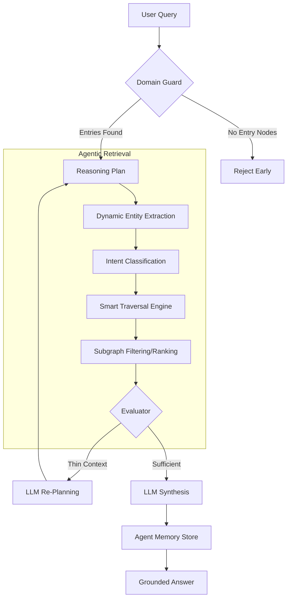

# Graph-RAG: System Architecture (Research Version 3.2)

This document provides a comprehensive technical overview of the Graph-RAG system as implemented in its most advanced state. It describes the **Agentic Reasoning Loop**, the **Multi-Tenant Graph Registry**, and the **Autonomous "Zero-Config" Pipeline**.

---

## 1. System Philosophy: "Adaptive Graph-Intelligence"
The mission of this project is to move beyond static, lexical RAG toward a **Dynamic Memory Platform**. The system treats Knowledge Graphs (KGs) not as passive data stores, but as active reasoning environments.

### Key Conceptual Pillars:
- **Zero-Config Autonomy**: The system "bootstraps" itself onto arbitrary graphs without human-defined mapping.
- **Agentic Iteration**: Retrieval is a non-linear process of planning, fetching, evaluating, and refining.
- **Multi-Tenancy**: Support for independent "Spaces" with their own credentials, schemas, and isolated memories.

---

## 2. Platform Architecture
The system is divided into three functional layers that allow for seamless switching between different knowledge domains.

### Layer 1: Connectivity & Lifecycle (The Registry)
- **Component**: `GraphRegistry` (`graph_rag/graph_registry.py`)
- **Action**: Manages the persistence of multiple KG connections.
- **Storage**: SQLite-backed registry storing credentials, cached schemas, and auto-generated configs.
- **Benefit**: Ensures that once a graph is "discovered," re-connecting is instant and localized.

### Layer 2: The Reasoning Engine (The Agentic Loop)
The system has transitioned from a linear 5-step pipeline to an **Iterative Agentic Loop**.

#### [NEW] The Loop Mechanism (Mermaid)

### Layer 3: Memory & Persistence
- **Component**: `AgentMemory` (`graph_rag/memory.py`)
- **Episodic Memory**: Stores past queries and high-signal answers.
- **Semantic Memory**: Uses vector embeddings to recall relevant past interactions during the "Plan" phase.
- **Isolation**: Memories are indexed by `kg_id`, ensuring no information leakage between different graphs.

---

## 3. Core Component Audit (V3.2 Status)

### Component 1: Query-Time Entity Extractor (`entity_extractor.py`)
- **V3.2 Enhancement**: Hybrid extraction. First uses n-gram lexical matching (fast/free), then falls back to LLM-aided extraction only if the lexical match fails. Incorporates **Semantic Search** (fallback embeddings) to handle synonyms.

### Component 2: Intent Classifier (`intent_classifier.py`)
- **V3.2 Enhancement**: Dual-path classification. Uses keyword mapping for 80% of specific intents and an "Abstract" path for conceptual queries (e.g., "Tell me the patterns in this data").

### Component 3: Smart Traversal Engine (`traversal_engine.py`)
- **Strategies**: 
  - `targeted`: 1-hop specific.
  - `chained`: Multi-hop discovery.
  - `variable_hop`: Neighborhood exploration.
  - `shortest_path`: Connecting disparate entities.
  - `shared_neighbor`: Pattern/Overlap detection.

### Component 4: Context Generator (`context_generator.py`)
- **V3.2 Enhancement**: Adaptive Context. For specific queries, it generates triple-based sentences. For abstract queries, it produces **Motif Summaries** (pattern-based frequency counts).

### Component 5: Agentic Pipeline (`agent.py` & `pipeline.py`)
- **V3.2 Enhancement**: **Adaptive Retry**. The system uses the LLM to analyze the *quality* of the retrieved context. If the data is "thin," it re-plans a new search query automatically.

---

## 4. The Autonomous Bootstrap (Zero-Config)
The breakthrough feature of V3.1+ is the ability to connect to a blank or unknown graph:

1. **Schema Discovery**: Scans Neo4j for metadata (labels, rels, properties).
2. **Identification Heuristics**: Identifies the "Subject" property of each node label by analyzing uniqueness and value frequency.
3. **Auto-Config API**: Dynamically builds the JSON config that the `IntentClassifier` and `TraversalEngine` require, rendering manual data-mapping obsolete.

---

## 5. Global Traceability & Hallucination Guard
Every response in Graph-RAG V3.2 is **fully grounded**:
- **Domain Guard**: Rejects queries for entities not present in the graph.
- **Source Citations**: The frontend renders citation cards for every relationship explored.
- **Verifiable Context**: The LLM is strictly prohibited via its system prompt from using internal training knowledge, ensuring "Traceable Truth."